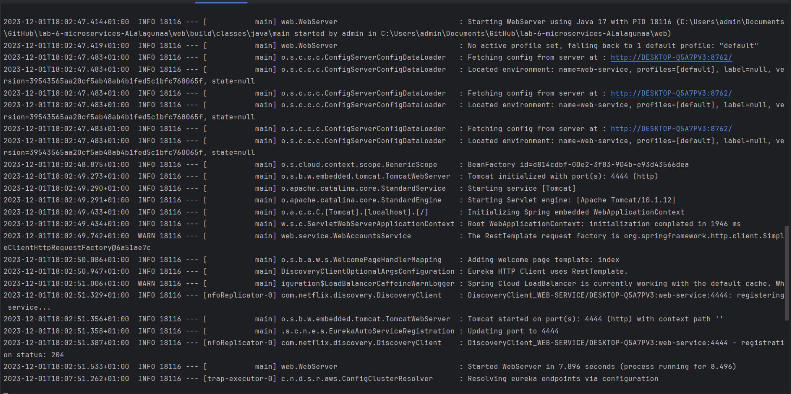
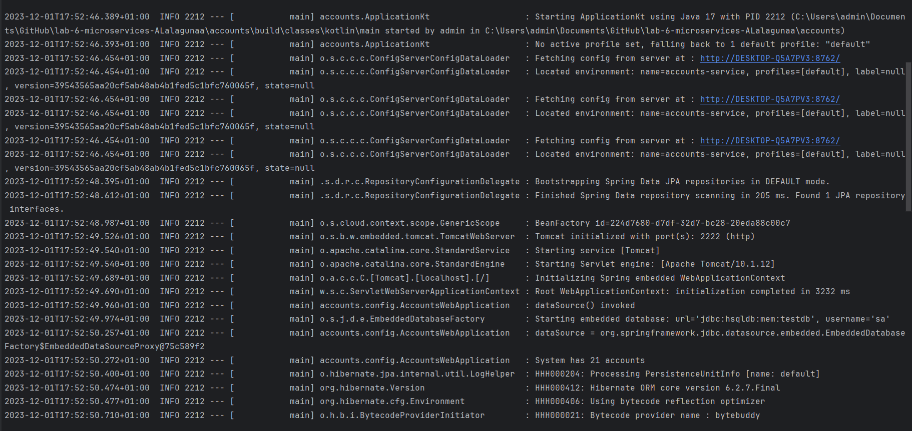
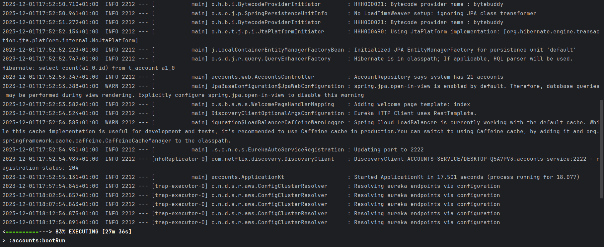
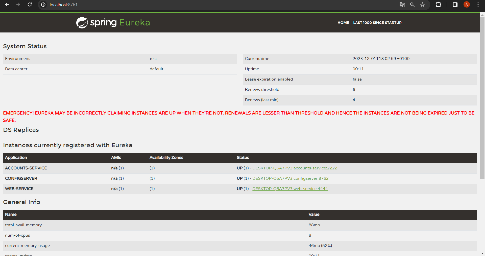

# Configuration for Lab 6

### 0. Link to my service configuration repository.
https://github.com/ALalagunaa/lab6-microservices-config-repo.git

### 1. Two services `accounts (2222)` and `web` are running and registered (two terminals). **2 Log screenshot**.
Para que funcionen ambos servicios, con el accounts en el 2222 hay que modificar ambos ficheros de configuración. En el **accounts-service.yml** modificamos el *server port* para que tenga el 2222. Tanto en el **accounts-service.yml** como en el **web-service.yml** añadimos las siguientes líneas:

El log de la terminal del servicio web es el siguiente:

El log de la terminal del servicio accounts es el siguiente:

### 2. The service registration service has these two services registered (a third terminal). **Eureka dashboard screenshot**.

### 3. Update the configuration repository so that the `accounts` service uses now the port 3333. **Link to the commit**.
https://github.com/ALalagunaa/lab6-microservices-config-repo/commit/2140df7abc5be88532566fecaf7adb8afe624332

### 4. Run a second instance of the `accounts` service using the new configuration (a fourth terminals). What happens? **Explain and Eureka dashboard screenshot**

### 5. What happens when you kill the service `accounts (2222)` and do requests to `web`?. **Explain and screenshots, including at least one Eureka dashboard screenshot** 

### 6. Can the web service provide information about the accounts again?. Why? **Explain and screenshots, including at least one Eureka dashboard screenshot** 
